# Battleship Multiplayer - Class Diagram

## Complete System Class Diagram

```mermaid
classDiagram
    %% Client Classes
    class UIManager {
        -GtkWidget* window
        -GtkWidget* stack
        -ClientNetwork* network
        -SessionStorage* session_storage
        -AssetManager* asset_manager
        -Player current_player
        -vector~Player~ online_players
        -map~string,GtkWidget*~ screens
        +UIManager()
        +initialize() bool
        +run() void
        +showScreen(ScreenType) void
        +handleLoginResponse(LoginResponse*) void
        +handleRegisterResponse(RegisterResponse*) void
        +handleLogoutResponse() void
        +updatePlayerList(vector~Player~) void
        -createLoginScreen() GtkWidget*
        -createRegisterScreen() GtkWidget*
        -createMainMenuScreen() GtkWidget*
        -createLobbyScreen() GtkWidget*
        -createGameScreen() GtkWidget*
    }

    class ClientNetwork {
        -int socket_fd_
        -atomic~ConnectionStatus~ status_
        -uint32_t user_id_
        -string session_token_
        -string display_name_
        -int32_t elo_rating_
        -thread receive_thread_
        -atomic~bool~ running_
        -mutex callback_mutex_
        -RegisterCallback register_callback_
        -LoginCallback login_callback_
        -LogoutCallback logout_callback_
        -ConnectionCallback connection_callback_
        +ClientNetwork()
        +~ClientNetwork()
        +connect(host, port, callback) bool
        +disconnect() void
        +registerUser(username, password, display_name, callback) void
        +loginUser(username, password, callback) void
        +logoutUser(callback) void
        +isConnected() bool
        +isAuthenticated() bool
        +getUserId() uint32_t
        +getSessionToken() string
        +getDisplayName() string
        +getEloRating() int32_t
        -connectSocket(host, port) bool
        -closeSocket() void
        -sendMessage(header, payload) bool
        -receiveMessage(header, payload) bool
        -receiveLoop() void
        -handleAuthResponse(payload) void
    }

    class SessionStorage {
        <<utility>>
        +saveSession(user_id, token, username, display_name, elo) bool
        +loadSession(user_id&, token&, username&, display_name&, elo&) bool
        +clearSession() void
        +hasStoredSession() bool
        -getSessionFilePath() string
    }

    class AssetManager {
        -map~string,GdkPixbuf*~ textures
        -map~string,string~ sounds
        +AssetManager()
        +~AssetManager()
        +loadAssets() bool
        +getTexture(name) GdkPixbuf*
        +playSound(name) void
        -loadTexture(path) GdkPixbuf*
    }

    %% Server Classes
    class Server {
        -int server_socket_
        -atomic~bool~ running_
        -DatabaseManager* database_
        -AuthHandler* auth_handler_
        -map~int,ClientConnection*~ clients_
        -mutex clients_mutex_
        -thread accept_thread_
        -int port_
        +Server(port)
        +~Server()
        +start() bool
        +stop() void
        +broadcast(message) void
        +getConnectedClients() int
        +getDatabase() DatabaseManager*
        -acceptClients() void
        -handleClient(socket) void
        -routeMessage(client, header, payload) void
        -removeClient(socket) void
    }

    class AuthHandler {
        -DatabaseManager* db_
        +AuthHandler(db)
        +handleRegister(request, response) void
        +handleLogin(request, response) void
        +handleLogout(request, response) void
        -validateUsername(username) bool
        -validatePassword(password) bool
        -generateSessionToken(user_id) string
    }

    class DatabaseManager {
        -sqlite3* db_
        -string db_path_
        -string last_error_
        +DatabaseManager(path)
        +~DatabaseManager()
        +isOpen() bool
        +createUser(username, password_hash, display_name) uint32_t
        +getUserByUsername(username) User
        +getUserById(user_id) User
        +updateLastLogin(user_id) bool
        +updateEloRating(user_id, elo) bool
        +usernameExists(username) bool
        +createSession(user_id, token, duration) uint32_t
        +getSessionByToken(token) Session
        +validateSession(token) uint32_t
        +deleteSession(token) bool
        +deleteUserSessions(user_id) bool
        +cleanupExpiredSessions() int
        +createMatch(player1_id, player2_id) uint32_t
        +getMatchById(match_id) Match
        +updateMatchStatus(match_id, status) bool
        +endMatch(match_id, winner_id) bool
        +getUserMatches(user_id, limit) vector~Match~
        +saveShipPlacement(match_id, user_id, ship_data) bool
        +getShipPlacement(match_id, user_id) string
        +saveMove(match_id, player_id, move_num, x, y, result) bool
        +getMatchMoves(match_id) vector~string~
        +getLastError() string
        -initializeSchema() bool
        -executeSQL(sql) bool
        -prepareStatement(sql) sqlite3_stmt*
    }

    class ClientConnection {
        -int socket_fd_
        -string client_address_
        -atomic~bool~ connected_
        -uint32_t user_id_
        -thread receive_thread_
        +ClientConnection(socket, address)
        +~ClientConnection()
        +send(header, payload) bool
        +receive(header, payload) bool
        +disconnect() void
        +isConnected() bool
        +setUserId(id) void
        +getUserId() uint32_t
        +getAddress() string
        -receiveLoop() void
    }

    %% Common Classes
    class Protocol {
        <<utility>>
        +parseHeader(buffer) MessageHeader
        +serializeHeader(header) vector~uint8_t~
        +validateMessage(header) bool
        +getMessageTypeName(type) string
    }

    class PasswordHash {
        <<utility>>
        +hashPassword(password) string
        +verifyPassword(password, stored_hash) bool
        -generateSalt() string
        -sha256(data) string
    }

    class GameState {
        -Board player_board
        -Board opponent_board
        -vector~Ship~ ships
        -GameStatus status
        -uint32_t current_player_id
        -uint32_t opponent_id
        +GameState()
        +placeShip(ship, x, y, orientation) bool
        +makeMove(x, y) MoveResult
        +receiveAttack(x, y) AttackResult
        +isGameOver() bool
        +getWinner() uint32_t
        +allShipsPlaced() bool
        +getPlayerBoard() Board&
        +getOpponentBoard() Board&
        -isValidPlacement(ship, x, y, orientation) bool
    }

    class Board {
        -CellState grid[10][10]
        -vector~Ship~ ships
        +Board()
        +getCell(x, y) CellState
        +setCell(x, y, state) void
        +placeShip(ship, x, y, orientation) bool
        +receiveAttack(x, y) AttackResult
        +allShipsSunk() bool
        +serialize() string
        +deserialize(data) bool
        -isValidPosition(x, y) bool
        -hasShipAt(x, y) bool
    }

    class Ship {
        -ShipType type
        -int length
        -int x
        -int y
        -Orientation orientation
        -vector~bool~ hit_positions
        +Ship(type)
        +getType() ShipType
        +getLength() int
        +getX() int
        +getY() int
        +getOrientation() Orientation
        +isSunk() bool
        +hit(position) void
        +getPositions() vector~Position~
        +occupiesPosition(x, y) bool
    }

    %% Data Structures
    class User {
        <<struct>>
        +uint32_t user_id
        +string username
        +string password_hash
        +string display_name
        +int32_t elo_rating
        +time_t created_at
        +time_t last_login
        +User()
    }

    class Session {
        <<struct>>
        +uint32_t session_id
        +uint32_t user_id
        +string session_token
        +time_t created_at
        +time_t expires_at
        +Session()
        +isExpired() bool
    }

    class Match {
        <<struct>>
        +uint32_t match_id
        +uint32_t player1_id
        +uint32_t player2_id
        +uint32_t winner_id
        +string status
        +time_t created_at
        +time_t ended_at
        +Match()
    }

    class Player {
        <<struct>>
        +uint32_t user_id
        +string username
        +string display_name
        +int32_t elo_rating
        +PlayerStatus status
        +Player()
    }

    class MessageHeader {
        <<struct>>
        +uint32_t magic
        +uint32_t version
        +MessageType type
        +uint32_t payload_size
    }

    class RegisterRequest {
        <<struct>>
        +char username[64]
        +char password[64]
        +char display_name[64]
    }

    class RegisterResponse {
        <<struct>>
        +bool success
        +uint32_t user_id
        +char error_message[256]
    }

    class LoginRequest {
        <<struct>>
        +char username[64]
        +char password[64]
    }

    class LoginResponse {
        <<struct>>
        +bool success
        +uint32_t user_id
        +char username[64]
        +char display_name[64]
        +int32_t elo_rating
        +char session_token[128]
        +char error_message[256]
    }

    class LogoutRequest {
        <<struct>>
        +char session_token[128]
    }

    class LogoutResponse {
        <<struct>>
        +bool success
    }

    %% Enums
    class MessageType {
        <<enumeration>>
        REGISTER_REQUEST
        REGISTER_RESPONSE
        LOGIN_REQUEST
        LOGIN_RESPONSE
        LOGOUT_REQUEST
        LOGOUT_RESPONSE
        PING
        PONG
    }

    class ConnectionStatus {
        <<enumeration>>
        DISCONNECTED
        CONNECTING
        CONNECTED
        AUTHENTICATION_PENDING
        AUTHENTICATED
        ERROR_STATE
    }

    class CellState {
        <<enumeration>>
        EMPTY
        SHIP
        HIT
        MISS
    }

    class ShipType {
        <<enumeration>>
        CARRIER
        BATTLESHIP
        CRUISER
        SUBMARINE
        DESTROYER
    }

    class Orientation {
        <<enumeration>>
        HORIZONTAL
        VERTICAL
    }

    class GameStatus {
        <<enumeration>>
        WAITING
        PLACING_SHIPS
        IN_PROGRESS
        COMPLETED
        DRAW
    }

    class AttackResult {
        <<enumeration>>
        MISS
        HIT
        SUNK
        INVALID
    }

    %% Relationships

    %% Client relationships
    UIManager --> ClientNetwork : uses
    UIManager --> SessionStorage : uses
    UIManager --> AssetManager : uses
    UIManager --> Player : manages
    ClientNetwork --> Protocol : uses
    ClientNetwork --> MessageHeader : creates
    ClientNetwork --> RegisterRequest : sends
    ClientNetwork --> LoginRequest : sends
    ClientNetwork --> LogoutRequest : sends
    ClientNetwork --> RegisterResponse : receives
    ClientNetwork --> LoginResponse : receives
    ClientNetwork --> LogoutResponse : receives
    ClientNetwork --> ConnectionStatus : has

    %% Server relationships
    Server --> AuthHandler : owns
    Server --> DatabaseManager : owns
    Server --> ClientConnection : manages
    Server --> Protocol : uses
    AuthHandler --> DatabaseManager : uses
    AuthHandler --> PasswordHash : uses
    AuthHandler --> User : creates
    AuthHandler --> Session : creates
    AuthHandler --> RegisterRequest : handles
    AuthHandler --> LoginRequest : handles
    AuthHandler --> LogoutRequest : handles
    AuthHandler --> RegisterResponse : creates
    AuthHandler --> LoginResponse : creates
    AuthHandler --> LogoutResponse : creates
    ClientConnection --> Protocol : uses
    ClientConnection --> MessageHeader : handles
    DatabaseManager --> User : manages
    DatabaseManager --> Session : manages
    DatabaseManager --> Match : manages

    %% Game State relationships
    GameState --> Board : contains
    GameState --> Ship : manages
    GameState --> GameStatus : has
    Board --> Ship : contains
    Board --> CellState : uses
    Board --> AttackResult : returns
    Ship --> ShipType : has
    Ship --> Orientation : has

    %% Common relationships
    Protocol --> MessageHeader : parses
    Protocol --> MessageType : uses
    SessionStorage --> User : stores data from
    User --> Session : has many
    Match --> User : references
```



## Architecture Notes

### Client-Side Components
- **UIManager**: Main GTK application controller, manages all screens and user interactions
- **ClientNetwork**: Handles TCP socket communication with server, async message processing
- **SessionStorage**: Persists session data to ~/.battleship/session.txt for auto-login
- **AssetManager**: Loads and manages game assets (textures, sounds)

### Server-Side Components
- **Server**: TCP server managing multiple client connections, message routing
- **AuthHandler**: Processes authentication requests (register, login, logout)
- **DatabaseManager**: SQLite database operations with prepared statements
- **ClientConnection**: Represents individual client connection, handles socket I/O

### Common Components
- **Protocol**: Message serialization/deserialization utilities
- **PasswordHash**: SHA-256 password hashing with salt
- **GameState**: Core game logic, board management, move validation
- **Board**: 10x10 grid with ship placement and attack handling
- **Ship**: Individual ship with hit tracking

### Data Flow

**Authentication Flow:**
```
Client (UIManager) -> ClientNetwork -> Server -> AuthHandler -> DatabaseManager
                                                    |
                                                    v
                                              PasswordHash (verify)
                                                    |
                                                    v
                   ClientNetwork <- Server <- AuthHandler
```

**Game Flow:**
```
Client (UIManager) -> GameState -> Board -> Ship
                         |
                         v
                    ClientNetwork -> Server -> Match in Database
```

### Design Patterns
- **Singleton**: Server, DatabaseManager (one instance)
- **Observer**: ClientNetwork callbacks, UI event handlers
- **Factory**: Message creation, Screen creation
- **Repository**: DatabaseManager (data access abstraction)
- **Strategy**: Different auth handlers, message handlers

### Thread Safety
- **Server**: Thread-safe client map with mutex
- **ClientNetwork**: Atomic status, mutex-protected callbacks
- **DatabaseManager**: SQLite WAL mode for concurrent access
- **UIManager**: GTK operations on main thread only (via g_idle_add)

---

Last Updated: 2025-11-17 04:00 UTC
