# Battleship Multiplayer - Class Diagram Breakdown

This document provides a detailed breakdown of each component in the class diagram with Mermaid diagrams for each section.

---

## Table of Contents

1. [Client-Side Components](#1-client-side-components)
2. [Server-Side Components](#2-server-side-components)
3. [Common/Shared Components](#3-commonshared-components)
4. [Game Logic Components](#4-game-logic-components)
5. [Authentication Messages](#5-authentication-messages)
6. [Database Models](#6-database-models)
7. [Message Flow Diagrams](#7-message-flow-diagrams)

---

## 1. Client-Side Components

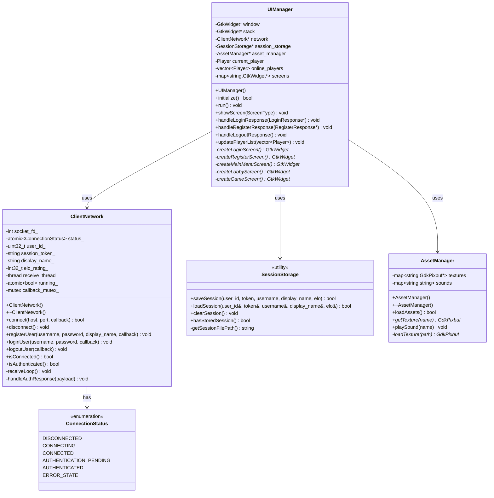

**Description**:

### UIManager
- **Purpose**: Main GTK application controller
- **Responsibilities**:
  - Manage UI screens (login, lobby, game)
  - Handle user input events
  - Display game state
  - Coordinate with ClientNetwork for server communication
- **Thread Safety**: All GTK operations on main thread via `g_idle_add()`
- **File**: `client/src/ui_manager.cpp`

### ClientNetwork
- **Purpose**: Handle TCP socket communication with server
- **Responsibilities**:
  - Establish/maintain connection
  - Send authentication requests
  - Receive responses asynchronously
  - Invoke callbacks on main thread
- **Thread Safety**: Atomic status, mutex-protected callbacks
- **File**: `client/src/client_network.cpp`

### SessionStorage
- **Purpose**: Persist session data for auto-login
- **Storage**: `~/.battleship/session.txt` (0600 permissions)
- **Format**: Plain text, 5 lines (user_id, token, username, display_name, elo)
- **File**: `client/src/session_storage.cpp`

### AssetManager
- **Purpose**: Load and manage game assets
- **Assets**: Ship textures, water textures, sound effects
- **File**: `client/src/asset_manager.cpp`

---

## 2. Server-Side Components

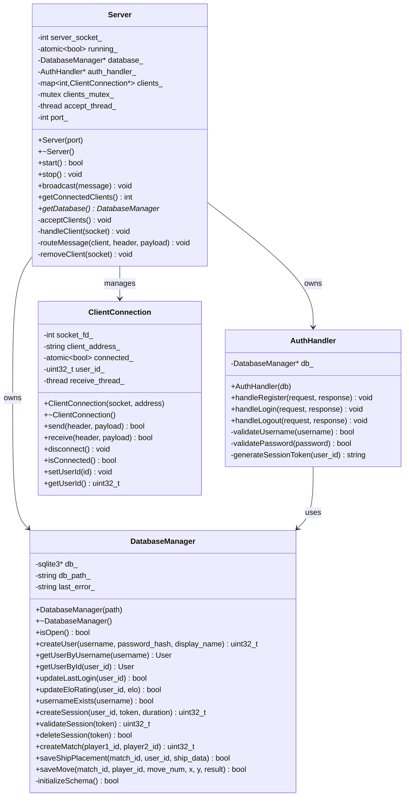

**Description**:

### Server
- **Purpose**: Main TCP server, manages client connections
- **Responsibilities**:
  - Accept incoming connections
  - Route messages to appropriate handlers
  - Manage client lifecycle
  - Broadcast messages
- **Thread Safety**: Mutex-protected clients map
- **File**: `server/src/server.cpp`

### AuthHandler
- **Purpose**: Process authentication requests
- **Responsibilities**:
  - Register new users (validate, hash password, create account)
  - Login users (verify credentials, create session)
  - Logout users (invalidate session)
  - Generate session tokens
- **Security**: Uses PasswordHash for secure password storage
- **File**: `server/src/auth_handler.cpp`

### DatabaseManager
- **Purpose**: SQLite database operations
- **Responsibilities**:
  - User CRUD operations
  - Session management
  - Match data persistence
  - Move history tracking
- **Configuration**: WAL mode, foreign keys enabled
- **File**: `server/src/database_manager.cpp`

### ClientConnection
- **Purpose**: Represents individual client connection
- **Responsibilities**:
  - Send/receive messages via socket
  - Track authentication state
  - Background receive thread
- **File**: `server/src/client_connection.cpp`

---

## 3. Common/Shared Components

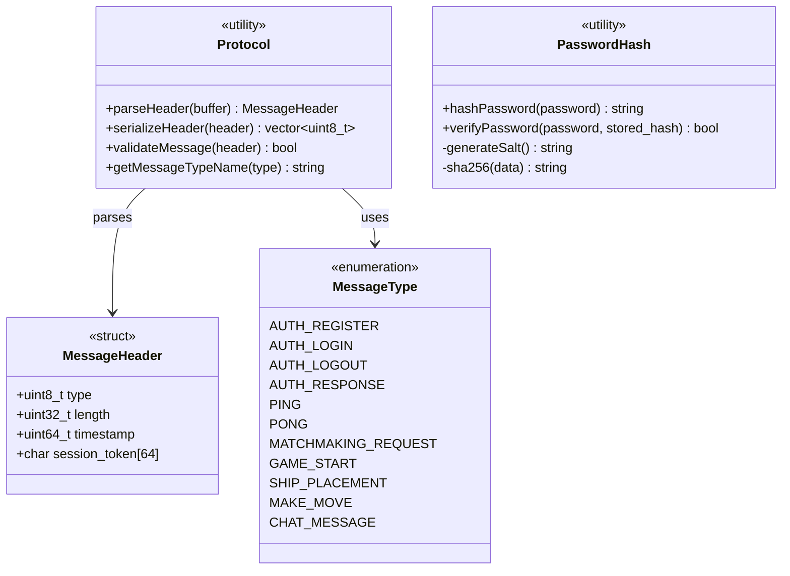

**Description**:

### Protocol
- **Purpose**: Message serialization/deserialization utilities
- **MessageHeader Structure** (77 bytes total):
  - `type`: uint8_t (1 byte) - Message type ID
  - `length`: uint32_t (4 bytes) - Payload size
  - `timestamp`: uint64_t (8 bytes) - Unix timestamp
  - `session_token`: char[64] (64 bytes) - Authentication token
- **File**: `common/include/protocol.h`

### PasswordHash
- **Purpose**: Secure password hashing with SHA-256 + salt
- **Hash Format**: `<salt>$<hash>` (32 hex chars + $ + 64 hex chars)
- **Security**:
  - Random 16-byte salt per password
  - Constant-time comparison
  - OpenSSL RAND_bytes for cryptographic randomness
- **File**: `common/src/password_hash.cpp`

### MessageType
- **Purpose**: Identifies message type
- **Categories**:
  - Authentication (1-10): REGISTER, LOGIN, LOGOUT, RESPONSE
  - Matchmaking (20-29): REQUEST, ACCEPT, DECLINE
  - Game (30-59): START, SHIP_PLACEMENT, MOVE, RESULT
  - Chat (60-79): MESSAGE, PRIVATE_MESSAGE
  - System (100+): PING, PONG, ERROR

### MessageSerialization
- **Template Functions**:
  ```cpp
  template<typename T>
  std::string serialize(const T& data) {
      return std::string(reinterpret_cast<const char*>(&data), sizeof(T));
  }

  template<typename T>
  bool deserialize(const std::string& payload, T& data) {
      if (payload.size() != sizeof(T)) return false;
      memcpy(&data, payload.data(), sizeof(T));
      return true;
  }
  ```
- **Requirements**: Works with POD types using `__attribute__((packed))`

---

## 4. Game Logic Components

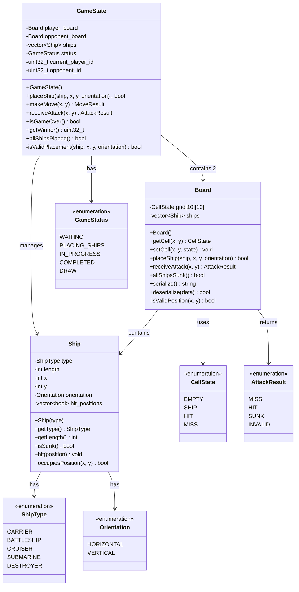

**Description**:

### GameState
- **Purpose**: Core game logic and state management
- **Flow**:
  1. WAITING → PLACING_SHIPS (both players join)
  2. PLACING_SHIPS → IN_PROGRESS (all ships placed)
  3. IN_PROGRESS → COMPLETED (all ships sunk)
- **File**: `common/src/game_state.cpp`

### Board
- **Purpose**: 10x10 grid with ship placement and attack handling
- **Grid**: 2D array of CellState (EMPTY, SHIP, HIT, MISS)
- **Methods**:
  - `placeShip()`: Validate and place ship
  - `receiveAttack()`: Process attack, return result
  - `serialize()`/`deserialize()`: Save/load board state
- **File**: `common/src/board.cpp`

### Ship
- **Purpose**: Individual ship with hit tracking
- **Types and Lengths**:
  - CARRIER: 5 cells
  - BATTLESHIP: 4 cells
  - CRUISER: 3 cells
  - SUBMARINE: 3 cells
  - DESTROYER: 2 cells
- **Hit Tracking**: Boolean array for each position
- **File**: `common/src/ship.cpp`

### Enums Explained

**CellState**: Visual representation
- EMPTY: `[~]` (water)
- SHIP: `[S]` (ship)
- HIT: `[X]` (hit)
- MISS: `[O]` (miss)

**AttackResult**: Attack outcome
- MISS: Hit water
- HIT: Hit ship (not sunk)
- SUNK: Hit ship and sank it
- INVALID: Invalid coordinates or already attacked

**Orientation**: Ship direction
- HORIZONTAL: Extends right (x increases)
- VERTICAL: Extends down (y increases)

---

## 5. Authentication Messages

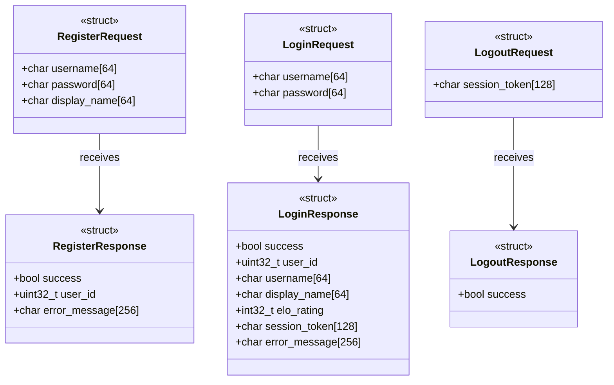

**Description**:

### RegisterRequest (192 bytes)
- **username**: Desired username (4-20 chars, alphanumeric)
- **password**: Plain text password (8+ chars, hashed by server)
- **display_name**: Display name shown in UI

### RegisterResponse (261 bytes)
- **success**: Registration succeeded
- **user_id**: New user ID (0 if failed)
- **error_message**: Error message if failed

### LoginRequest (128 bytes)
- **username**: Username
- **password**: Password

### LoginResponse (521 bytes)
- **success**: Login succeeded
- **user_id**: User ID
- **username**: Username
- **display_name**: Display name
- **elo_rating**: Current ELO rating
- **session_token**: Session token for future requests
- **error_message**: Error message if failed

### LogoutRequest (128 bytes)
- **session_token**: Session token to invalidate

### LogoutResponse (1 byte)
- **success**: Logout succeeded

**All structs**: `__attribute__((packed))` for binary compatibility

**File**: `common/include/messages/authentication_messages.h`

---

## 6. Database Models

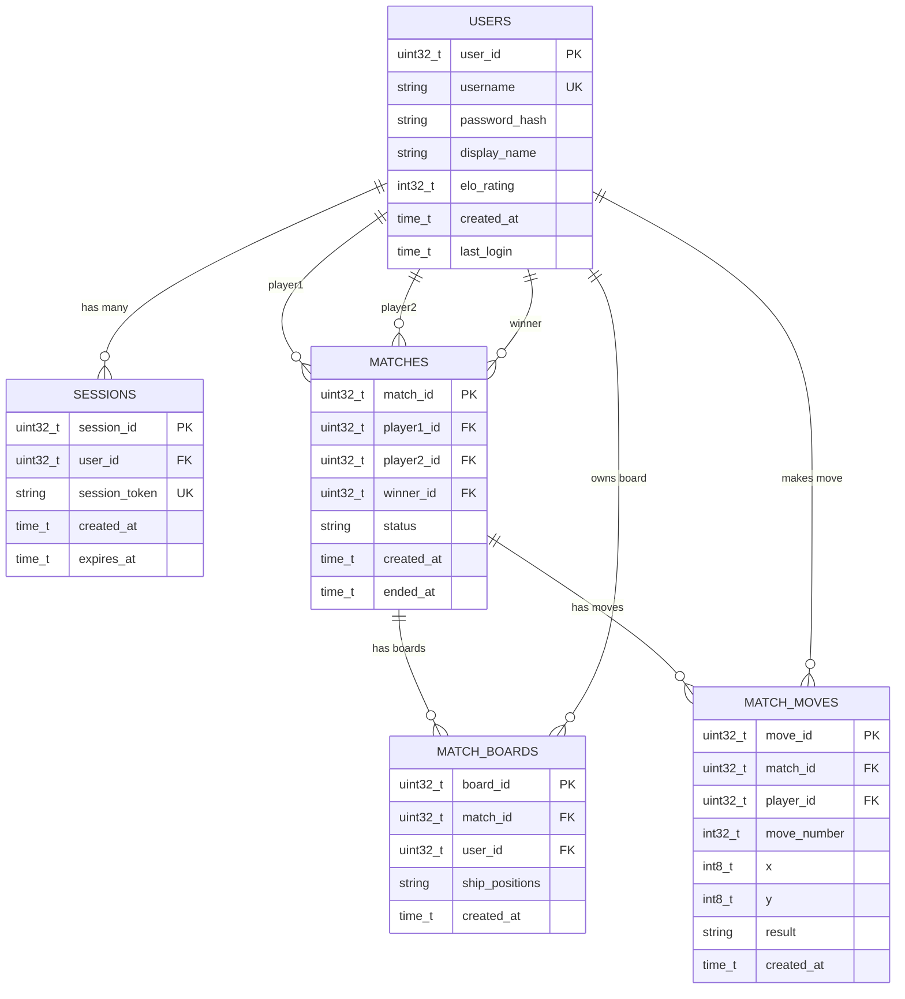

**Description**:

### User Model
```cpp
struct User {
    uint32_t user_id;
    string username;
    string password_hash;
    string display_name;
    int32_t elo_rating;
    time_t created_at;
    time_t last_login;
};
```
- **File**: `common/include/models/user.h`

### Session Model
```cpp
struct Session {
    uint32_t session_id;
    uint32_t user_id;
    string session_token;
    time_t created_at;
    time_t expires_at;

    bool isExpired() {
        return time(nullptr) > expires_at;
    }
};
```
- **File**: `common/include/models/session.h`

### Match Model
```cpp
struct Match {
    uint32_t match_id;
    uint32_t player1_id;
    uint32_t player2_id;
    uint32_t winner_id;
    string status;
    time_t created_at;
    time_t ended_at;
};
```
- **File**: `common/include/models/match.h`

### Player Model (UI Display)
```cpp
struct Player {
    uint32_t user_id;
    string username;
    string display_name;
    int32_t elo_rating;
    PlayerStatus status;  // ONLINE, OFFLINE, IN_GAME, AWAY
};
```
- **File**: `common/include/models/player.h`

---

## 7. Message Flow Diagrams

### 7.1 Registration Flow

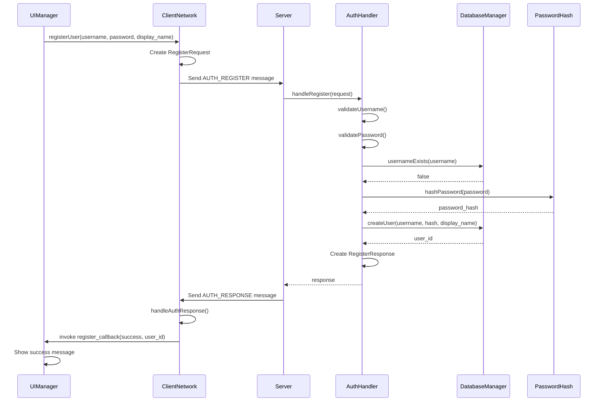

### 7.2 Login Flow

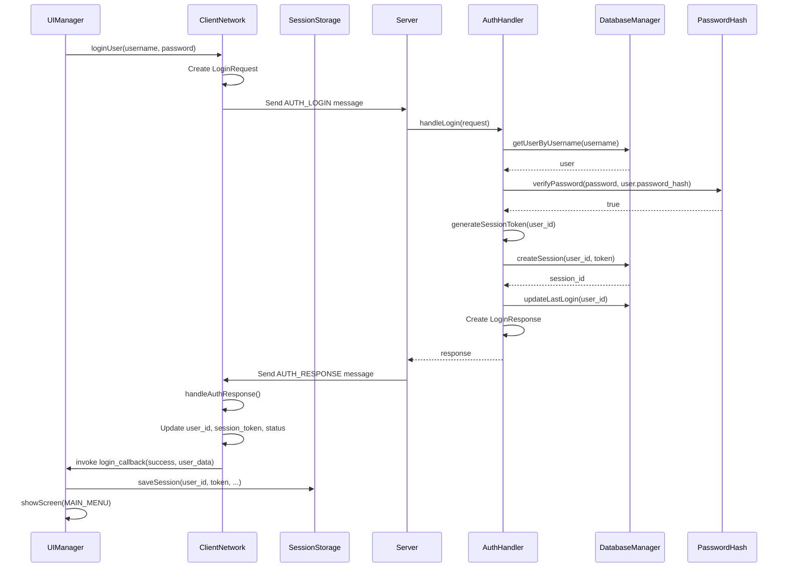

### 7.3 Auto-Login Flow

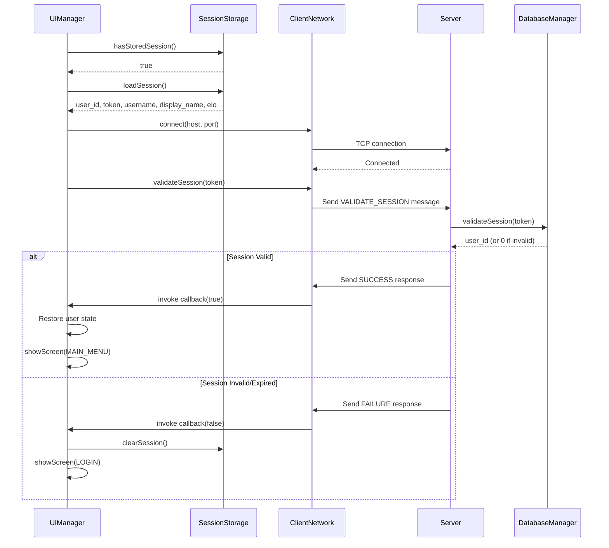

### 7.4 Game Flow

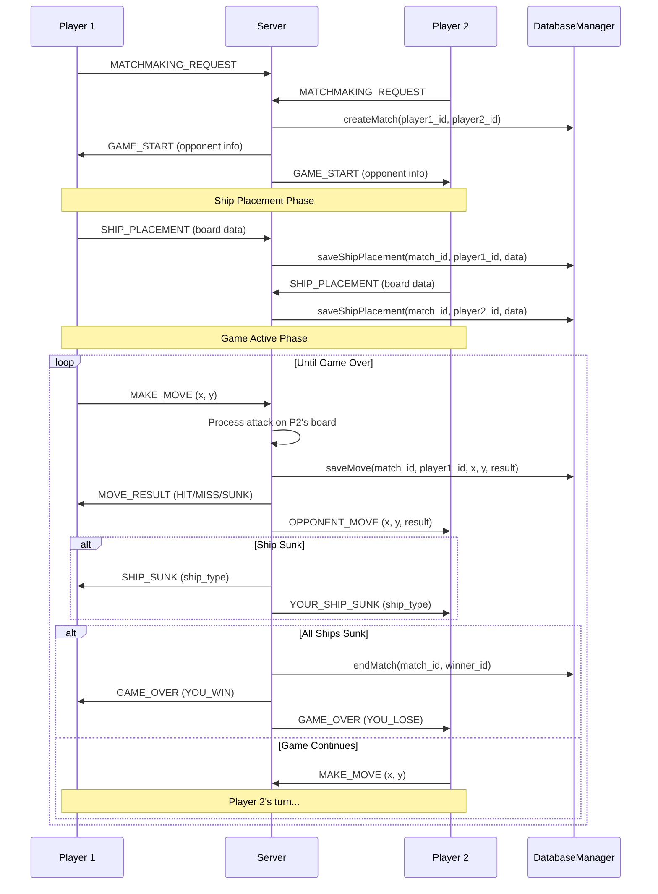

### 7.5 Thread Communication

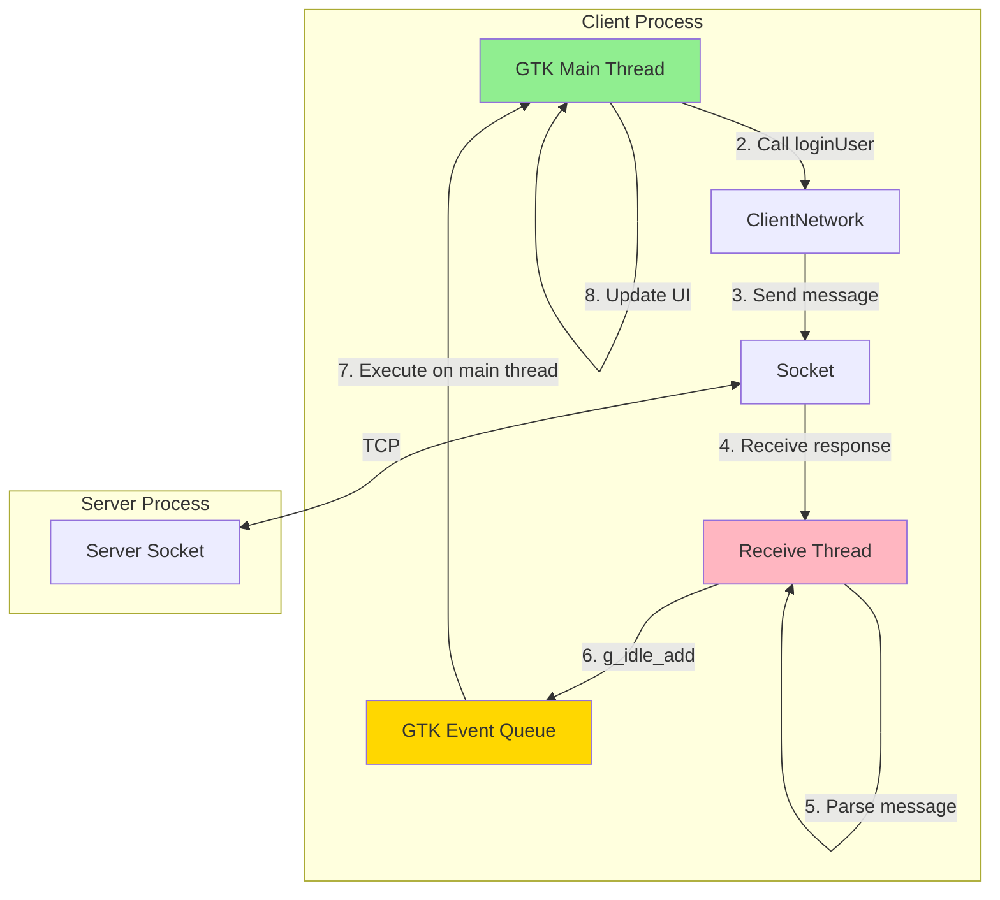

**Key Points**:
- **GTK Main Thread**: Handles all UI operations
- **Receive Thread**: Background thread for network I/O
- **g_idle_add**: Safely dispatch callbacks to main thread
- **Mutex**: Protects shared callback data

---

## 8. Design Patterns Summary

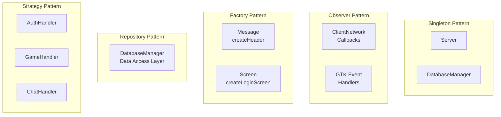

**Descriptions**:

- **Singleton**: Server and DatabaseManager have single instances
- **Observer**: Callbacks notify when async events occur
- **Factory**: Factory methods create complex objects (messages, screens)
- **Repository**: DatabaseManager abstracts SQL, provides clean API
- **Strategy**: Different handlers for different message types

---

## 9. Security Considerations

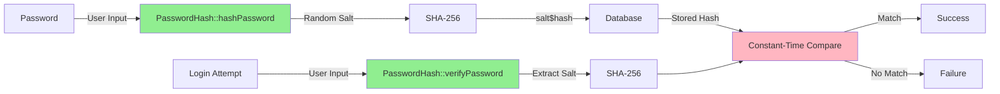

**Security Features**:

1. **Password Hashing**:
   - SHA-256 with random 16-byte salt
   - Never store plain text passwords
   - Each password gets unique salt

2. **Constant-Time Comparison**:
   - Prevents timing attacks
   - Compare all characters even if mismatch found early

3. **Session Tokens**:
   - 128-character random tokens
   - Expire after 24 hours
   - Stored securely in database

4. **File Permissions**:
   - Session file: 0600 (owner only)
   - Database file: 0600 (owner only)

5. **SQL Injection Prevention**:
   - Prepared statements
   - Parameter binding
   - No string concatenation

6. **Input Validation**:
   - Username: 4-20 chars, alphanumeric
   - Password: 8+ chars
   - Display name: 64 chars max

---

Last Updated: 2025-11-21
