# Battleship Multiplayer - Database Schema

## Complete Entity-Relationship Diagram

```mermaid
erDiagram
    USERS ||--o{ SESSIONS : "has"
    USERS ||--o{ MATCHES_AS_PLAYER1 : "plays as player1"
    USERS ||--o{ MATCHES_AS_PLAYER2 : "plays as player2"
    USERS ||--o{ MATCHES_AS_WINNER : "wins"
    MATCHES ||--o{ MATCH_BOARDS : "contains"
    MATCHES ||--o{ MATCH_MOVES : "contains"
    USERS ||--o{ MATCH_BOARDS : "owns board"
    USERS ||--o{ MATCH_MOVES : "makes move"

    USERS {
        INTEGER user_id PK "Auto-increment, Primary Key"
        TEXT username UK "UNIQUE, NOT NULL, 3-20 chars"
        TEXT password_hash "NOT NULL, SHA-256 with salt, format: salt$hash"
        TEXT display_name "NOT NULL, Display name in UI"
        INTEGER elo_rating "NOT NULL, DEFAULT 1000, Player rating"
        INTEGER created_at "NOT NULL, Unix timestamp"
        INTEGER last_login "DEFAULT 0, Unix timestamp"
    }

    SESSIONS {
        INTEGER session_id PK "Auto-increment, Primary Key"
        INTEGER user_id FK "NOT NULL, Foreign Key -> users.user_id"
        TEXT session_token UK "UNIQUE, NOT NULL, Unique session token"
        INTEGER created_at "NOT NULL, Unix timestamp"
        INTEGER expires_at "NOT NULL, Unix timestamp, default +24h"
    }

    MATCHES {
        INTEGER match_id PK "Auto-increment, Primary Key"
        INTEGER player1_id FK "NOT NULL, Foreign Key -> users.user_id"
        INTEGER player2_id FK "NOT NULL, Foreign Key -> users.user_id"
        INTEGER winner_id FK "NULLABLE, Foreign Key -> users.user_id"
        TEXT status "NOT NULL, Values: waiting, in_progress, completed, draw"
        INTEGER created_at "NOT NULL, Unix timestamp"
        INTEGER ended_at "NULLABLE, Unix timestamp"
    }

    MATCH_BOARDS {
        INTEGER board_id PK "Auto-increment, Primary Key"
        INTEGER match_id FK "NOT NULL, Foreign Key -> matches.match_id"
        INTEGER user_id FK "NOT NULL, Foreign Key -> users.user_id"
        TEXT ship_data "NOT NULL, Serialized ship positions"
        INTEGER created_at "NOT NULL, Unix timestamp"
    }

    MATCH_MOVES {
        INTEGER move_id PK "Auto-increment, Primary Key"
        INTEGER match_id FK "NOT NULL, Foreign Key -> matches.match_id"
        INTEGER player_id FK "NOT NULL, Foreign Key -> users.user_id"
        INTEGER move_number "NOT NULL, Sequential move number 1, 2, 3..."
        INTEGER x "NOT NULL, X coordinate 0-9"
        INTEGER y "NOT NULL, Y coordinate 0-9"
        TEXT result "NOT NULL, Values: miss, hit, sunk"
        INTEGER timestamp "NOT NULL, Unix timestamp"
    }

    MATCHES_AS_PLAYER1 {
        INTEGER match_id PK
        INTEGER player1_id FK
    }

    MATCHES_AS_PLAYER2 {
        INTEGER match_id PK
        INTEGER player2_id FK
    }

    MATCHES_AS_WINNER {
        INTEGER match_id PK
        INTEGER winner_id FK
    }
```



---

## Schema Details

### Table: USERS
**Purpose**: Store user account information

**Columns:**
| Column | Type | Constraints | Description |
|--------|------|-------------|-------------|
| user_id | INTEGER | PRIMARY KEY AUTOINCREMENT | Unique user identifier |
| username | TEXT | NOT NULL, UNIQUE | Login username (3-20 chars) |
| password_hash | TEXT | NOT NULL | SHA-256 hash with salt (format: `salt$hash`) |
| display_name | TEXT | NOT NULL | Display name shown in game |
| elo_rating | INTEGER | NOT NULL DEFAULT 1000 | Player's ELO rating for matchmaking |
| created_at | INTEGER | NOT NULL | Account creation timestamp (Unix) |
| last_login | INTEGER | DEFAULT 0 | Last login timestamp (Unix) |

**Indexes:**
- `UNIQUE INDEX idx_username ON users(username)` - Fast username lookup for login

**Example:**
```sql
INSERT INTO users (user_id, username, password_hash, display_name, elo_rating, created_at, last_login)
VALUES (1, 'player123', 'a1b2c3d4$abc123def456...', 'Player One', 1000, 1700000000, 1700100000);
```

---

### Table: SESSIONS
**Purpose**: Manage user authentication sessions

**Columns:**
| Column | Type | Constraints | Description |
|--------|------|-------------|-------------|
| session_id | INTEGER | PRIMARY KEY AUTOINCREMENT | Unique session identifier |
| user_id | INTEGER | NOT NULL, FOREIGN KEY | Reference to users.user_id |
| session_token | TEXT | NOT NULL, UNIQUE | Unique session token string |
| created_at | INTEGER | NOT NULL | Session creation timestamp |
| expires_at | INTEGER | NOT NULL | Session expiration timestamp (+24h default) |

**Indexes:**
- `UNIQUE INDEX idx_session_token ON sessions(session_token)` - Fast session validation
- `INDEX idx_user_sessions ON sessions(user_id)` - List user's active sessions

**Foreign Keys:**
- `FOREIGN KEY (user_id) REFERENCES users(user_id) ON DELETE CASCADE`

**Session Management:**
- Default lifetime: 24 hours
- Token format: `token_{user_id}_{random_hash}`
- Expired sessions cleaned up automatically
- One user can have multiple sessions (multi-device support)

**Example:**
```sql
INSERT INTO sessions (session_id, user_id, session_token, created_at, expires_at)
VALUES (1, 1, 'token_1_a1b2c3d4', 1700100000, 1700186400);  -- +86400 seconds (24h)
```

---

### Table: MATCHES
**Purpose**: Track game matches between two players

**Columns:**
| Column | Type | Constraints | Description |
|--------|------|-------------|-------------|
| match_id | INTEGER | PRIMARY KEY AUTOINCREMENT | Unique match identifier |
| player1_id | INTEGER | NOT NULL, FOREIGN KEY | First player's user_id |
| player2_id | INTEGER | NOT NULL, FOREIGN KEY | Second player's user_id |
| winner_id | INTEGER | NULLABLE, FOREIGN KEY | Winner's user_id (NULL if draw/ongoing) |
| status | TEXT | NOT NULL | Match status: waiting, in_progress, completed, draw |
| created_at | INTEGER | NOT NULL | Match creation timestamp |
| ended_at | INTEGER | NULLABLE | Match end timestamp (NULL if ongoing) |

**Indexes:**
- `INDEX idx_player1_matches ON matches(player1_id)` - Get player 1's matches
- `INDEX idx_player2_matches ON matches(player2_id)` - Get player 2's matches
- `INDEX idx_match_status ON matches(status)` - Filter by match status

**Foreign Keys:**
- `FOREIGN KEY (player1_id) REFERENCES users(user_id)`
- `FOREIGN KEY (player2_id) REFERENCES users(user_id)`
- `FOREIGN KEY (winner_id) REFERENCES users(user_id)`

**Status Values:**
- `"waiting"` - Match created, waiting for second player or ship placement
- `"in_progress"` - Game is actively being played
- `"completed"` - Game finished with a winner
- `"draw"` - Game ended in a draw

**Example:**
```sql
INSERT INTO matches (match_id, player1_id, player2_id, winner_id, status, created_at, ended_at)
VALUES (1, 1, 2, 1, 'completed', 1700100000, 1700100600);  -- Player 1 won after 10 minutes
```

---

### Table: MATCH_BOARDS
**Purpose**: Store ship placement for each player in a match

**Columns:**
| Column | Type | Constraints | Description |
|--------|------|-------------|-------------|
| board_id | INTEGER | PRIMARY KEY AUTOINCREMENT | Unique board identifier |
| match_id | INTEGER | NOT NULL, FOREIGN KEY | Reference to matches.match_id |
| user_id | INTEGER | NOT NULL, FOREIGN KEY | Player who owns this board |
| ship_data | TEXT | NOT NULL | Serialized ship placement data |
| created_at | INTEGER | NOT NULL | Board creation timestamp |

**Indexes:**
- `INDEX idx_match_boards ON match_boards(match_id)` - Get all boards for a match
- `UNIQUE INDEX idx_user_match_board ON match_boards(match_id, user_id)` - One board per player per match

**Foreign Keys:**
- `FOREIGN KEY (match_id) REFERENCES matches(match_id) ON DELETE CASCADE`
- `FOREIGN KEY (user_id) REFERENCES users(user_id)`

**Ship Data Format:**
```
carrier:0,0,H;battleship:2,0,V;cruiser:5,3,H;submarine:1,5,V;destroyer:7,8,H
```
- Format: `{ship_type}:{x},{y},{orientation};`
- ship_type: carrier, battleship, cruiser, submarine, destroyer
- x,y: Starting coordinates (0-9)
- orientation: H (horizontal) or V (vertical)

**Example:**
```sql
INSERT INTO match_boards (board_id, match_id, user_id, ship_data, created_at)
VALUES (1, 1, 1, 'carrier:0,0,H;battleship:2,0,V;cruiser:5,3,H;submarine:1,5,V;destroyer:7,8,H', 1700100000);
```

---

### Table: MATCH_MOVES
**Purpose**: Record all moves made during a match

**Columns:**
| Column | Type | Constraints | Description |
|--------|------|-------------|-------------|
| move_id | INTEGER | PRIMARY KEY AUTOINCREMENT | Unique move identifier |
| match_id | INTEGER | NOT NULL, FOREIGN KEY | Reference to matches.match_id |
| player_id | INTEGER | NOT NULL, FOREIGN KEY | Player who made the move |
| move_number | INTEGER | NOT NULL | Sequential move number (1, 2, 3, ...) |
| x | INTEGER | NOT NULL | X coordinate of attack (0-9) |
| y | INTEGER | NOT NULL | Y coordinate of attack (0-9) |
| result | TEXT | NOT NULL | Move result: miss, hit, sunk |
| timestamp | INTEGER | NOT NULL | Move timestamp |

**Indexes:**
- `INDEX idx_match_moves ON match_moves(match_id)` - Get all moves for a match
- `INDEX idx_move_sequence ON match_moves(match_id, move_number)` - Sequential move retrieval

**Foreign Keys:**
- `FOREIGN KEY (match_id) REFERENCES matches(match_id) ON DELETE CASCADE`
- `FOREIGN KEY (player_id) REFERENCES users(user_id)`

**Result Values:**
- `"miss"` - Attack missed (hit water)
- `"hit"` - Attack hit a ship (but didn't sink it)
- `"sunk"` - Attack hit a ship and sunk it completely

**Example:**
```sql
INSERT INTO match_moves (move_id, match_id, player_id, move_number, x, y, result, timestamp)
VALUES (1, 1, 1, 1, 5, 7, 'hit', 1700100050);  -- Player 1's first move was a hit
```

---

## Database Configuration

### SQLite Pragmas

```sql
-- Enable Write-Ahead Logging for concurrent access
PRAGMA journal_mode=WAL;

-- Enable foreign key constraints
PRAGMA foreign_keys = ON;

-- Optimize for performance
PRAGMA synchronous = NORMAL;
PRAGMA cache_size = -64000;  -- 64MB cache
PRAGMA temp_store = MEMORY;
```

**Benefits:**
- **WAL Mode**: Allows concurrent readers + 1 writer, better performance
- **Foreign Keys**: Enforces referential integrity, prevents orphaned records
- **Performance**: Optimized cache and synchronous settings

---

## Common Queries

### User Authentication

**Register New User:**
```sql
INSERT INTO users (username, password_hash, display_name, elo_rating, created_at, last_login)
VALUES (?, ?, ?, 1000, strftime('%s', 'now'), 0);
```

**Login - Get User by Username:**
```sql
SELECT user_id, username, password_hash, display_name, elo_rating
FROM users
WHERE username = ?;
```

**Create Session:**
```sql
INSERT INTO sessions (user_id, session_token, created_at, expires_at)
VALUES (?, ?, strftime('%s', 'now'), strftime('%s', 'now') + 86400);  -- +24h
```

**Validate Session:**
```sql
SELECT user_id
FROM sessions
WHERE session_token = ?
  AND expires_at > strftime('%s', 'now');
```

**Logout - Delete Session:**
```sql
DELETE FROM sessions WHERE session_token = ?;
```

**Update Last Login:**
```sql
UPDATE users SET last_login = strftime('%s', 'now') WHERE user_id = ?;
```

### Match Management

**Create New Match:**
```sql
INSERT INTO matches (player1_id, player2_id, status, created_at)
VALUES (?, ?, 'waiting', strftime('%s', 'now'));
```

**Get Match by ID:**
```sql
SELECT m.*,
       u1.username as player1_name,
       u1.display_name as player1_display,
       u2.username as player2_name,
       u2.display_name as player2_display,
       w.username as winner_name
FROM matches m
LEFT JOIN users u1 ON m.player1_id = u1.user_id
LEFT JOIN users u2 ON m.player2_id = u2.user_id
LEFT JOIN users w ON m.winner_id = w.user_id
WHERE m.match_id = ?;
```

**Update Match Status:**
```sql
UPDATE matches SET status = ? WHERE match_id = ?;
```

**End Match with Winner:**
```sql
UPDATE matches
SET status = 'completed',
    winner_id = ?,
    ended_at = strftime('%s', 'now')
WHERE match_id = ?;
```

**Get User's Match History:**
```sql
SELECT m.*,
       CASE WHEN m.player1_id = ? THEN u2.username ELSE u1.username END as opponent_name,
       CASE WHEN m.winner_id = ? THEN 'won'
            WHEN m.winner_id IS NULL THEN 'draw'
            ELSE 'lost' END as result
FROM matches m
LEFT JOIN users u1 ON m.player1_id = u1.user_id
LEFT JOIN users u2 ON m.player2_id = u2.user_id
WHERE (m.player1_id = ? OR m.player2_id = ?)
  AND m.status = 'completed'
ORDER BY m.ended_at DESC
LIMIT ?;
```

### Board & Moves

**Save Ship Placement:**
```sql
INSERT INTO match_boards (match_id, user_id, ship_data, created_at)
VALUES (?, ?, ?, strftime('%s', 'now'));
```

**Get Ship Placement:**
```sql
SELECT ship_data
FROM match_boards
WHERE match_id = ? AND user_id = ?;
```

**Record Move:**
```sql
INSERT INTO match_moves (match_id, player_id, move_number, x, y, result, timestamp)
VALUES (?, ?, ?, ?, ?, ?, strftime('%s', 'now'));
```

**Get All Moves for Match:**
```sql
SELECT m.*, u.username as player_name
FROM match_moves m
LEFT JOIN users u ON m.player_id = u.user_id
WHERE m.match_id = ?
ORDER BY m.move_number ASC;
```

### Maintenance

**Cleanup Expired Sessions:**
```sql
DELETE FROM sessions
WHERE expires_at < strftime('%s', 'now');
```

**Get Active Users Count:**
```sql
SELECT COUNT(DISTINCT user_id) as active_users
FROM sessions
WHERE expires_at > strftime('%s', 'now');
```

**Get Match Statistics:**
```sql
SELECT
    COUNT(*) as total_matches,
    SUM(CASE WHEN status = 'in_progress' THEN 1 ELSE 0 END) as active_matches,
    SUM(CASE WHEN status = 'completed' THEN 1 ELSE 0 END) as completed_matches
FROM matches;
```

**Get Top Players by ELO:**
```sql
SELECT user_id, username, display_name, elo_rating,
       (SELECT COUNT(*) FROM matches WHERE (player1_id = users.user_id OR player2_id = users.user_id) AND status = 'completed') as games_played,
       (SELECT COUNT(*) FROM matches WHERE winner_id = users.user_id) as wins
FROM users
ORDER BY elo_rating DESC
LIMIT 10;
```

---

## Data Lifecycle

### User Registration Flow
```
1. Receive registration request with username, password, display_name
2. Hash password with SHA-256 + salt
3. INSERT INTO users (username, password_hash, display_name, ...)
4. Return user_id to client
```

### Login Flow
```
1. Receive login request with username, password
2. SELECT user FROM users WHERE username = ?
3. Verify password using PasswordHash::verifyPassword()
4. If valid:
   - Generate session token
   - INSERT INTO sessions (user_id, session_token, ...)
   - UPDATE users SET last_login = now()
   - Return user data + session token
```

### Match Creation Flow
```
1. Player 1 creates match
   - INSERT INTO matches (player1_id, player2_id, status='waiting')
2. Both players place ships
   - INSERT INTO match_boards (match_id, user_id, ship_data)
   - INSERT INTO match_boards (match_id, user_id, ship_data)
3. Match starts
   - UPDATE matches SET status='in_progress'
4. Players take turns
   - INSERT INTO match_moves (match_id, player_id, move_number, x, y, result)
5. Match ends
   - UPDATE matches SET status='completed', winner_id=?, ended_at=now()
```

---

## Database Maintenance

### Scheduled Tasks

**Hourly:**
- Clean up expired sessions
- Update match statistics cache

**Daily:**
- Vacuum database for optimization
- Update ELO ratings leaderboard
- Generate daily statistics

**Weekly:**
- Full database backup
- Analyze slow queries
- Optimize indexes

### Backup Strategy

```bash
# Online backup (server running)
sqlite3 data/battleship.db ".backup data/battleship_backup.db"

# With WAL files
cp data/battleship.db data/backup/battleship_$(date +%Y%m%d_%H%M%S).db
cp data/battleship.db-wal data/backup/battleship_$(date +%Y%m%d_%H%M%S).db-wal
cp data/battleship.db-shm data/backup/battleship_$(date +%Y%m%d_%H%M%S).db-shm

# Restore
cp data/backup/battleship_20250117_120000.db data/battleship.db
```

### Performance Monitoring

```sql
-- Check database size
SELECT page_count * page_size as size FROM pragma_page_count(), pragma_page_size();

-- Check table sizes
SELECT name, SUM(pgsize) as size FROM dbstat GROUP BY name ORDER BY size DESC;

-- Check index usage
EXPLAIN QUERY PLAN SELECT * FROM users WHERE username = 'test';
```

---

## Security Considerations

1. **Password Storage**: Never store plaintext passwords, always use SHA-256 + salt
2. **SQL Injection**: Use prepared statements for all queries
3. **Session Security**:
   - 24h expiration by default
   - Secure random token generation
   - Validate on every request
4. **Foreign Keys**: Enabled to prevent orphaned records
5. **Cascade Deletes**: Sessions and match data deleted when user is deleted

---

Last Updated: 2025-11-17 04:05 UTC
