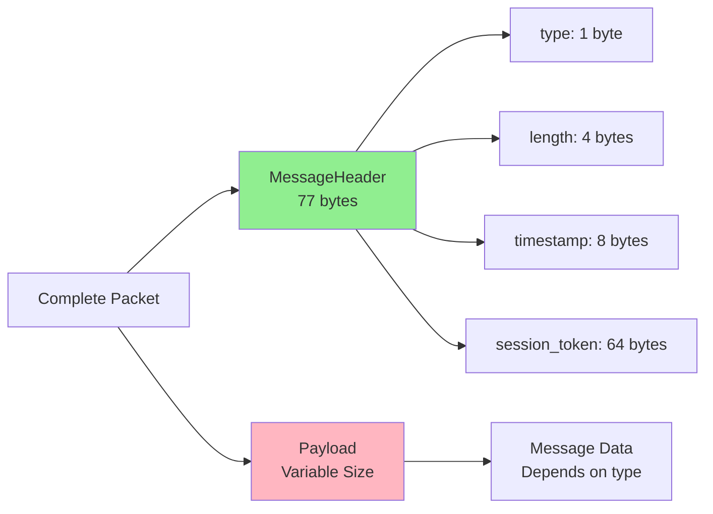
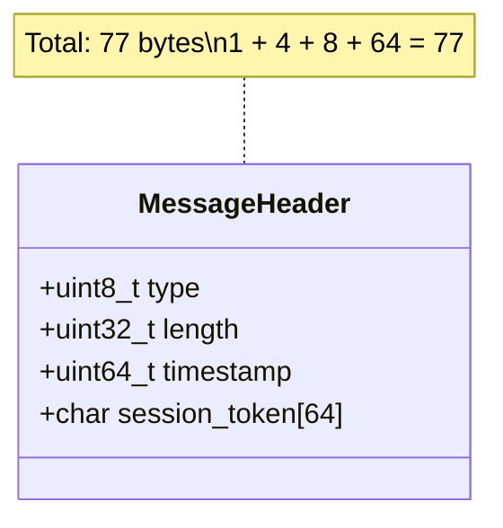
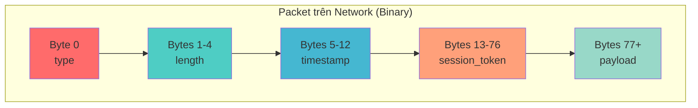
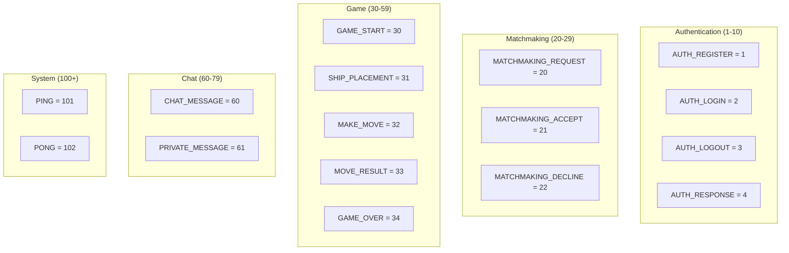
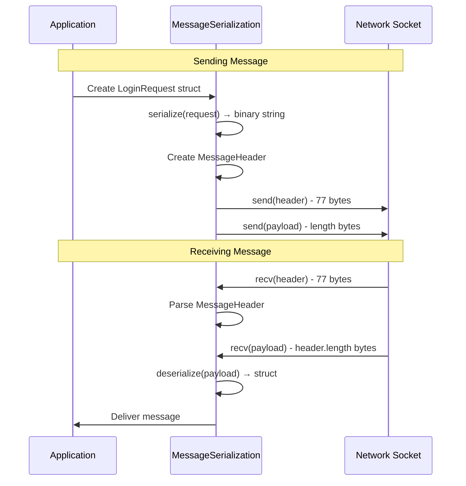
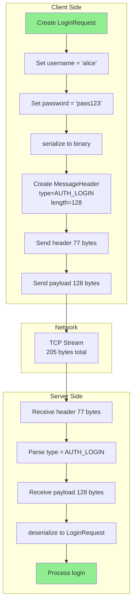
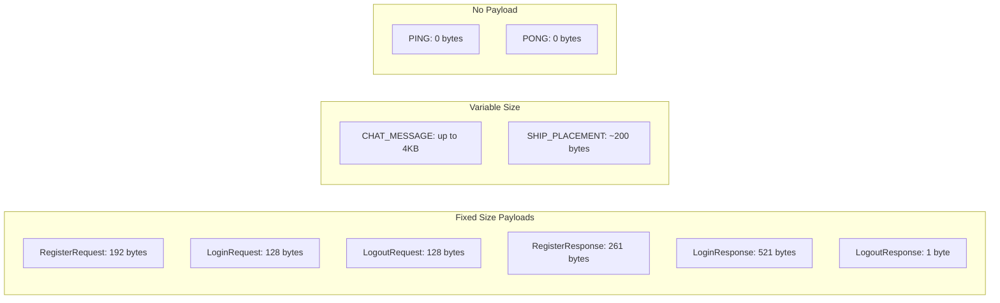

# Battleship Multiplayer - Packet Structure

Tổng quan về cấu trúc gói tin (packet) trong hệ thống Battleship Multiplayer.

---

## 1. Cấu Trúc Packet Tổng Quát



**Mô tả**:
- Mỗi packet gồm 2 phần: **Header** (cố định 77 bytes) + **Payload** (kích thước thay đổi)
- Header chứa metadata về message
- Payload chứa dữ liệu thực tế của message

---

## 2. Chi Tiết MessageHeader (77 bytes)



**Các trường trong Header**:

| Trường | Kiểu dữ liệu | Kích thước | Mô tả |
|--------|-------------|-----------|-------|
| `type` | `uint8_t` | 1 byte | Loại message (AUTH_LOGIN, SHIP_PLACEMENT, ...) |
| `length` | `uint32_t` | 4 bytes | Kích thước payload (bytes) |
| `timestamp` | `uint64_t` | 8 bytes | Unix timestamp (thời điểm gửi) |
| `session_token` | `char[64]` | 64 bytes | Token xác thực (cho authenticated messages) |

---

## 3. Binary Layout



**Ví dụ Login Request**:
```
[Header: 77 bytes]
  type: 0x02 (AUTH_LOGIN)
  length: 128 (sizeof(LoginRequest))
  timestamp: 1700000000
  session_token: [empty - 64 null bytes]

[Payload: 128 bytes]
  username: "alice\0\0..." (64 bytes)
  password: "mypassword\0\0..." (64 bytes)

Total: 77 + 128 = 205 bytes
```

---

## 4. Message Types



---

## 5. Serialization Flow



**Serialization Functions**:
```cpp
// Convert struct to binary string
template<typename T>
std::string serialize(const T& data) {
    return std::string(reinterpret_cast<const char*>(&data), sizeof(T));
}

// Convert binary string to struct
template<typename T>
bool deserialize(const std::string& payload, T& data) {
    if (payload.size() != sizeof(T)) return false;
    memcpy(&data, payload.data(), sizeof(T));
    return true;
}
```

---

## 6. Example: Login Request Packet



**Binary Representation**:
```
Offset | Data                           | Description
-------|--------------------------------|------------------
0x00   | 02                             | type = AUTH_LOGIN
0x01   | 80 00 00 00                    | length = 128 (little-endian)
0x05   | 00 94 65 65 00 00 00 00        | timestamp
0x0D   | 00 00 00 ... (60 more bytes)   | session_token (empty)
0x4D   | 61 6C 69 63 65 00 ... (58)     | username "alice"
0x8D   | 70 61 73 73 31 32 33 00 ... (57) | password "pass123"
```

---

## 7. Payload Size by Message Type



---

## 8. Important Notes

### Packed Structs
Tất cả message structs sử dụng `__attribute__((packed))`:
```cpp
struct LoginRequest {
    char username[64];
    char password[64];
} __attribute__((packed));
```
- Đảm bảo không có padding bytes
- Kích thước chính xác, nhất quán giữa client/server
- Cross-platform compatibility

### Network Byte Order
- **Header fields**: Giữ nguyên host byte order (hiện tại)
- **TCP**: Đảm bảo thứ tự bytes khi truyền
- **Future**: Có thể cần htonl/ntohl cho multi-platform

### TCP Stream vs Packets
- TCP là **stream-based**, không có packet boundaries
- Sử dụng `length` field để biết khi nào đủ data
- Luôn recv với `MSG_WAITALL` để đảm bảo đủ bytes:
  ```cpp
  recv(socket, &header, sizeof(MessageHeader), MSG_WAITALL);
  recv(socket, payload, header.length, MSG_WAITALL);
  ```

---

**File Location**: `common/include/protocol.h`, `common/include/message_serialization.h`

Last Updated: 2025-11-21
