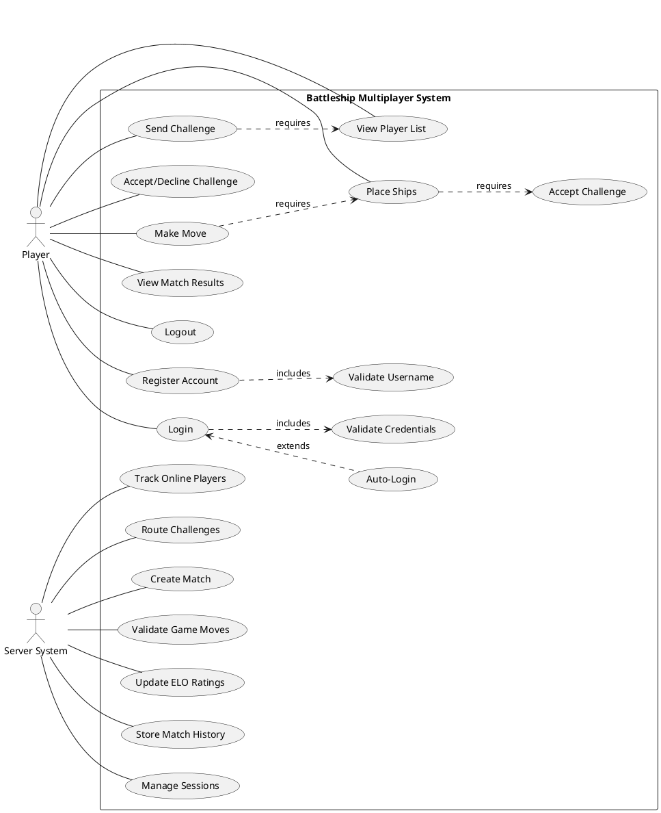

# 3. Design Diagrams and System Analysis

## 3.1 Use Case Diagram

### Actors
- **Player**: End user who plays the game
- **Server System**: Backend system managing game logic and data

### Use Cases

**Player Use Cases:**
1. Register Account
2. Login to System
3. View Player List
4. Send Challenge
5. Accept/Decline Challenge
6. Place Ships
7. Make Move (Fire at coordinate)
8. View Match Results
9. Request Rematch
10. Logout

**System Use Cases:**
1. Validate Credentials
2. Manage Sessions
3. Track Online Players
4. Route Challenges
5. Create Match
6. Validate Game Moves
7. Update ELO Ratings
8. Store Match History

### Use Case Relationships
- **Register Account** → includes → Validate Username
- **Login** → includes → Validate Credentials → extends → Auto-Login
- **Send Challenge** → requires → View Player List
- **Place Ships** → requires → Accept Challenge
- **Make Move** → requires → Place Ships

### Diagram Instructions
**Tool**: draw.io, Lucidchart, or PlantUML



**Expected Output**: Save as `diagrams/01_use_case_diagram.png` (600 DPI minimum)

---

## 3.2 System Architecture Diagram

### Architecture Components

**Three-Tier Architecture:**

1. **Presentation Layer (Client)**
   - GTK+ UI components
   - Event handlers
   - Local state management
   - Session storage

2. **Application Layer (Server)**
   - TCP socket listener
   - Message routing
   - Business logic handlers
   - Concurrent client management

3. **Data Layer (Database)**
   - SQLite database
   - CRUD operations
   - Transaction management

### Component Diagram

```
┌─────────────────────────────────────────────────────────┐
│                    CLIENT APPLICATION                    │
├─────────────────────────────────────────────────────────┤
│                                                          │
│  ┌─────────────────────────────────────────────────┐   │
│  │          Presentation Layer (GTK)                │   │
│  │  ┌─────────┐  ┌──────────┐  ┌──────────────┐   │   │
│  │  │  Login  │  │  Lobby   │  │  Game Board  │   │   │
│  │  │  Screen │  │  Screen  │  │    Screen    │   │   │
│  │  └────┬────┘  └─────┬────┘  └──────┬───────┘   │   │
│  └───────┼─────────────┼──────────────┼───────────┘   │
│          │             │              │                │
│  ┌───────▼─────────────▼──────────────▼───────────┐   │
│  │            UI Manager (Controller)              │   │
│  └───────┬──────────────────────────────┬──────────┘   │
│          │                              │               │
│  ┌───────▼────────┐            ┌────────▼─────────┐   │
│  │ Client Network │            │ Session Storage  │   │
│  │   (TCP Client) │            │ (~/.battleship)  │   │
│  └────────┬───────┘            └──────────────────┘   │
│           │                                             │
└───────────┼─────────────────────────────────────────────┘
            │
            │ TCP Socket (Port 9999)
            │ Binary Protocol Messages
            │
┌───────────▼─────────────────────────────────────────────┐
│                    SERVER APPLICATION                    │
├─────────────────────────────────────────────────────────┤
│                                                          │
│  ┌────────────────────────────────────────────────┐    │
│  │        Server (Multi-threaded TCP Listener)    │    │
│  │  - Accept connections (bind, listen, accept)   │    │
│  │  - Spawn thread per client (std::thread)       │    │
│  │  - Message routing (handleClient loop)         │    │
│  └───┬──────────────────┬──────────────────┬──────┘    │
│      │                  │                  │            │
│  ┌───▼──────────┐  ┌───▼─────────────┐  ┌▼──────────┐ │
│  │  Auth        │  │  Player         │  │ Challenge  │ │
│  │  Handler     │  │  Handler        │  │ Handler    │ │
│  │              │  │                 │  │            │ │
│  │ - Register   │  │ - List players  │  │ - Send     │ │
│  │ - Login      │  │ - Status update │  │ - Accept   │ │
│  │ - Validate   │  │                 │  │ - Decline  │ │
│  └───┬──────────┘  └─────────────────┘  └──────┬─────┘ │
│      │                                          │       │
│  ┌───▼──────────────────────────────────────────▼────┐ │
│  │              Manager Layer                        │ │
│  │  ┌────────────┐  ┌──────────────┐  ┌──────────┐  │ │
│  │  │ Database   │  │ Player       │  │Challenge │  │ │
│  │  │ Manager    │  │ Manager      │  │ Manager  │  │ │
│  │  └──────┬─────┘  └──────────────┘  └──────────┘  │ │
│  └─────────┼──────────────────────────────────────────┘ │
│            │                                             │
└────────────┼─────────────────────────────────────────────┘
             │
             │ SQL Queries (Prepared Statements)
             │
┌────────────▼─────────────────────────────────────────────┐
│                    DATABASE LAYER                        │
├─────────────────────────────────────────────────────────┤
│                                                          │
│  ┌────────────────────────────────────────────────┐    │
│  │         SQLite Database (WAL Mode)             │    │
│  │                                                 │    │
│  │  ┌─────────┐  ┌──────────┐  ┌──────────────┐  │    │
│  │  │  users  │  │ sessions │  │   matches    │  │    │
│  │  ├─────────┤  ├──────────┤  ├──────────────┤  │    │
│  │  │user_id  │  │session_id│  │match_id      │  │    │
│  │  │username │  │user_id   │  │player1_id    │  │    │
│  │  │password_│  │token     │  │player2_id    │  │    │
│  │  │  hash   │  │expires_at│  │winner_id     │  │    │
│  │  │elo_     │  └──────────┘  │status        │  │    │
│  │  │ rating  │                 └──────────────┘  │    │
│  │  └─────────┘                                    │    │
│  │                                                 │    │
│  │  ┌──────────────┐  ┌─────────────────────┐    │    │
│  │  │match_boards  │  │   match_moves       │    │    │
│  │  ├──────────────┤  ├─────────────────────┤    │    │
│  │  │board_id      │  │move_id              │    │    │
│  │  │match_id      │  │match_id             │    │    │
│  │  │user_id       │  │player_id            │    │    │
│  │  │ship_data     │  │move_number          │    │    │
│  │  │  (JSON)      │  │x, y, result         │    │    │
│  │  └──────────────┘  └─────────────────────┘    │    │
│  └────────────────────────────────────────────────┘    │
│                                                          │
│             data/battleship.db                           │
└─────────────────────────────────────────────────────────┘
```

**Expected Output**: Save as `diagrams/02_system_architecture.png`

---

## 3.3 Authentication Flow Diagram

### Registration Flow

```
┌────────┐                 ┌────────┐              ┌──────────┐
│ Client │                 │ Server │              │ Database │
└───┬────┘                 └───┬────┘              └────┬─────┘
    │                          │                        │
    │  REGISTER_REQUEST        │                        │
    │  (username, password)    │                        │
    ├─────────────────────────►│                        │
    │                          │                        │
    │                          │  Check username exists │
    │                          ├───────────────────────►│
    │                          │                        │
    │                          │◄───────────────────────┤
    │                          │  Username available    │
    │                          │                        │
    │                          │  Hash password         │
    │                          │  (SHA-256 + salt)      │
    │                          │                        │
    │                          │  INSERT INTO users     │
    │                          ├───────────────────────►│
    │                          │                        │
    │                          │◄───────────────────────┤
    │                          │  user_id created       │
    │                          │                        │
    │  REGISTER_RESPONSE       │  Generate session token│
    │  (success, user_id)      │                        │
    │◄─────────────────────────┤  INSERT INTO sessions  │
    │                          ├───────────────────────►│
    │                          │                        │
    │                          │◄───────────────────────┤
    │                          │  Session created       │
    │  Save session locally    │                        │
    │  (~/.battleship/         │                        │
    │   session.txt)           │                        │
    │                          │                        │
    │  Show main menu          │                        │
    │                          │                        │
```

### Login Flow

```
┌────────┐                 ┌────────┐              ┌──────────┐
│ Client │                 │ Server │              │ Database │
└───┬────┘                 └───┬────┘              └────┬─────┘
    │                          │                        │
    │  LOGIN_REQUEST           │                        │
    │  (username, password)    │                        │
    ├─────────────────────────►│                        │
    │                          │                        │
    │                          │  SELECT * FROM users   │
    │                          │  WHERE username=?      │
    │                          ├───────────────────────►│
    │                          │                        │
    │                          │◄───────────────────────┤
    │                          │  User data + password_ │
    │                          │  hash                  │
    │                          │                        │
    │                          │  Verify password       │
    │                          │  (constant-time cmp)   │
    │                          │                        │
    │                          │  Generate new token    │
    │                          │                        │
    │                          │  INSERT/UPDATE sessions│
    │                          ├───────────────────────►│
    │                          │                        │
    │  LOGIN_RESPONSE          │◄───────────────────────┤
    │  (success, token, info)  │  Session created       │
    │◄─────────────────────────┤                        │
    │                          │                        │
    │  Save session locally    │                        │
    │                          │                        │
    │  Show main menu          │                        │
    │                          │                        │
```

### Auto-Login Flow (with Server Validation)

```
┌────────┐                 ┌────────┐              ┌──────────┐
│ Client │                 │ Server │              │ Database │
└───┬────┘                 └───┬────┘              └────┬─────┘
    │                          │                        │
    │  App starts              │                        │
    │                          │                        │
    │  Load session from       │                        │
    │  ~/.battleship/          │                        │
    │  session.txt             │                        │
    │                          │                        │
    │  Found: user_id, token   │                        │
    │                          │                        │
    │  Connect to server       │                        │
    ├─────────────────────────►│                        │
    │                          │                        │
    │  VALIDATE_SESSION        │                        │
    │  (user_id, token)        │                        │
    ├─────────────────────────►│                        │
    │                          │                        │
    │                          │  SELECT * FROM sessions│
    │                          │  WHERE user_id=?       │
    │                          │  AND session_token=?   │
    │                          ├───────────────────────►│
    │                          │                        │
    │                          │◄───────────────────────┤
    │                          │  Session data          │
    │                          │                        │
    │                          │  Check expires_at      │
    │                          │  > current_time?       │
    │                          │                        │
    │  VALIDATE_RESPONSE       │                        │
    │  (valid=true, user_info) │                        │
    │◄─────────────────────────┤                        │
    │                          │                        │
    │  Show main menu          │  Register player as    │
    │  (skip login screen)     │  online in PlayerMgr   │
    │                          │                        │
    │                          │  Broadcast PLAYER_     │
    │                          │  STATUS_UPDATE         │
    │                          │                        │
```

**Expected Output**: Save as `diagrams/03_authentication_flow.png`

---

## 3.4 Matchmaking Flow Diagram

### Direct Challenge Flow

```
┌──────────┐              ┌────────┐              ┌──────────┐
│ Player A │              │ Server │              │ Player B │
└────┬─────┘              └───┬────┘              └────┬─────┘
     │                        │                        │
     │  View Player List      │                        │
     │                        │                        │
     │  PLAYER_LIST_REQUEST   │                        │
     ├───────────────────────►│                        │
     │                        │                        │
     │  PLAYER_LIST_RESPONSE  │                        │
     │  (all online players)  │                        │
     │◄───────────────────────┤                        │
     │                        │                        │
     │  Select Player B       │                        │
     │  Click "Challenge"     │                        │
     │                        │                        │
     │  CHALLENGE_SEND        │                        │
     │  (target_user_id=B)    │                        │
     ├───────────────────────►│                        │
     │                        │                        │
     │                        │  Validate:             │
     │                        │  - A is authenticated  │
     │                        │  - B is online         │
     │                        │  - B is available      │
     │                        │  - Not self-challenge  │
     │                        │                        │
     │                        │  Store in              │
     │                        │  ChallengeManager      │
     │                        │  (60s timeout)         │
     │                        │                        │
     │                        │  CHALLENGE_RECEIVED    │
     │                        │  (challenge_id, A_info)│
     │                        ├───────────────────────►│
     │                        │                        │
     │                        │                        │  Show
     │                        │                        │  dialog:
     │                        │                        │  "Player A
     │                        │                        │  challenges
     │                        │                        │  you!"
     │                        │                        │
     │                        │                        │  User clicks
     │                        │                        │  "Accept"
     │                        │                        │
     │                        │  CHALLENGE_RESPONSE    │
     │                        │  (challenge_id, accept)│
     │                        │◄───────────────────────┤
     │                        │                        │
     │                        │  Create match in DB:   │
     │                        │  INSERT INTO matches   │
     │                        │  (player1_id=A,        │
     │                        │   player2_id=B,        │
     │                        │   status=waiting_ships)│
     │                        │                        │
     │                        │  Set A status=IN_GAME  │
     │                        │  Set B status=IN_GAME  │
     │                        │                        │
     │  MATCH_START           │                        │
     │  (match_id=123)        │                        │
     │◄───────────────────────┤                        │
     │                        │                        │
     │                        │  MATCH_START           │
     │                        │  (match_id=123)        │
     │                        ├───────────────────────►│
     │                        │                        │
     │  Transition to         │                        │  Transition
     │  Ship Placement        │                        │  to Ship
     │  screen                │                        │  Placement
     │                        │                        │
```

### Challenge Timeout Flow

```
┌──────────┐              ┌────────┐              ┌──────────┐
│ Player A │              │ Server │              │ Player B │
└────┬─────┘              └───┬────┘              └────┬─────┘
     │                        │                        │
     │  CHALLENGE_SEND        │                        │
     ├───────────────────────►│                        │
     │                        │                        │
     │                        │  CHALLENGE_RECEIVED    │
     │                        ├───────────────────────►│
     │                        │                        │
     │                        │  Store with timestamp  │
     │                        │  created_at = now()    │
     │                        │                        │
     │  ... 60 seconds ...    │  ... 60 seconds ...    │  User
     │                        │                        │  doesn't
     │                        │                        │  respond
     │                        │                        │
     │                        │  Background thread     │
     │                        │  checks timeout:       │
     │                        │  now() - created_at    │
     │                        │  > 60s                 │
     │                        │                        │
     │                        │  Remove challenge      │
     │                        │  from pending map      │
     │                        │                        │
     │  CHALLENGE_TIMEOUT     │                        │
     │  (challenge_id, reason)│                        │
     │◄───────────────────────┤                        │
     │                        │                        │
     │  Show notification:    │  CHALLENGE_TIMEOUT     │
     │  "Player B did not     │  (challenge_id, reason)│
     │  respond"              ├───────────────────────►│
     │                        │                        │
     │  Back to lobby         │                        │  Dialog
     │                        │                        │  auto-closes
     │                        │                        │
```

**Expected Output**: Save as `diagrams/04_matchmaking_flow.png`

---

## 3.5 Gameplay Flow Diagram

### Ship Placement Phase

```
┌──────────┐              ┌────────┐              ┌──────────┐
│ Player A │              │ Server │              │ Player B │
└────┬─────┘              └───┬────┘              └────┬─────┘
     │                        │                        │
     │  Match started         │                        │  Match
     │  Show ship placement   │                        │  started
     │  UI                    │                        │
     │                        │                        │
     │  User drags 5 ships    │                        │  User drags
     │  onto 10x10 grid       │                        │  5 ships
     │                        │                        │
     │  Client validates:     │                        │  Client
     │  - No overlap          │                        │  validates
     │  - No touching         │                        │
     │  - All 5 placed        │                        │
     │                        │                        │
     │  Enable "Ready" button │                        │
     │                        │                        │
     │  User clicks "Ready"   │                        │
     │                        │                        │
     │  SHIP_PLACEMENT        │                        │
     │  (ship_positions JSON) │                        │
     ├───────────────────────►│                        │
     │                        │                        │
     │                        │  Validate server-side: │
     │                        │  - All 5 ships         │
     │                        │  - Valid positions     │
     │                        │  - No overlaps         │
     │                        │                        │
     │                        │  INSERT INTO           │
     │                        │  match_boards          │
     │                        │  (ship_data)           │
     │                        │                        │
     │  PLACEMENT_RESULT      │  Mark A as ready       │
     │  (success)             │                        │
     │◄───────────────────────┤                        │
     │                        │                        │
     │  Show "Waiting for     │                        │  User clicks
     │  opponent..."          │                        │  "Ready"
     │                        │                        │
     │                        │  SHIP_PLACEMENT        │
     │                        │  (ship_positions)      │
     │                        │◄───────────────────────┤
     │                        │                        │
     │                        │  Validate & store      │
     │                        │  Mark B as ready       │
     │                        │                        │
     │                        │  Both ready!           │
     │                        │  Randomly select       │
     │                        │  first turn            │
     │                        │                        │
     │  MATCH_READY           │                        │
     │  (your_turn=true)      │                        │
     │◄───────────────────────┤                        │
     │                        │                        │
     │                        │  MATCH_READY           │
     │  Transition to game    │  (your_turn=false)     │
     │  board                 ├───────────────────────►│
     │  "Your turn" indicator │                        │
     │                        │                        │  Show "Waiting"
     │                        │                        │
```

### Turn-Based Gameplay

```
┌──────────┐              ┌────────┐              ┌──────────┐
│ Player A │              │ Server │              │ Player B │
└────┬─────┘              └───┬────┘              └────┬─────┘
     │                        │                        │
     │  [A's turn]            │                        │  [Waiting]
     │                        │                        │
     │  Click coordinate (5,7)│                        │
     │  on opponent board     │                        │
     │                        │                        │
     │  MOVE                  │                        │
     │  (x=5, y=7)            │                        │
     ├───────────────────────►│                        │
     │                        │                        │
     │                        │  Validate:             │
     │                        │  - Is A's turn?        │
     │                        │  - Valid coords?       │
     │                        │  - Not shot before?    │
     │                        │                        │
     │                        │  Load B's board from   │
     │                        │  match_boards table    │
     │                        │                        │
     │                        │  Check hit/miss:       │
     │                        │  Does (5,7) overlap    │
     │                        │  any of B's ships?     │
     │                        │                        │
     │                        │  Result: HIT           │
     │                        │  Ship: Destroyer       │
     │                        │  Sunk: Yes (all cells  │
     │                        │        hit)            │
     │                        │                        │
     │                        │  INSERT INTO           │
     │                        │  match_moves           │
     │                        │  (result=SUNK)         │
     │                        │                        │
     │                        │  Check win condition:  │
     │                        │  All B's ships sunk?   │
     │                        │  No → continue         │
     │                        │                        │
     │                        │  Switch turn to B      │
     │                        │                        │
     │  MOVE_RESULT           │                        │
     │  (hit=true, sunk=true, │                        │
     │   ship=DESTROYER)      │                        │
     │◄───────────────────────┤                        │
     │                        │                        │
     │  Show explosion        │  TURN_UPDATE           │
     │  animation             │  (your_turn=true)      │
     │  Mark destroyer sunk   ├───────────────────────►│
     │  on opponent board     │                        │
     │                        │                        │  Show hit
     │  [Now waiting]         │                        │  on own board
     │                        │                        │
     │                        │                        │  [B's turn]
     │                        │                        │  Enabled
     │                        │                        │
```

### Match End

```
┌──────────┐              ┌────────┐              ┌──────────┐
│ Player A │              │ Server │              │ Player B │
└────┬─────┘              └───┬────┘              └────┬─────┘
     │                        │                        │
     │  MOVE (x=2, y=3)       │                        │
     ├───────────────────────►│                        │
     │                        │                        │
     │                        │  Check: HIT & SUNK     │
     │                        │  (Carrier - last ship) │
     │                        │                        │
     │                        │  All B's ships sunk!   │
     │                        │  → A wins              │
     │                        │                        │
     │                        │  UPDATE matches SET    │
     │                        │  winner_id=A,          │
     │                        │  status='completed',   │
     │                        │  ended_at=now()        │
     │                        │                        │
     │                        │  Calculate ELO change: │
     │                        │  A: 1200 → 1225 (+25)  │
     │                        │  B: 1180 → 1165 (-15)  │
     │                        │                        │
     │                        │  UPDATE users SET      │
     │                        │  elo_rating=...        │
     │                        │                        │
     │  MATCH_END             │                        │
     │  (winner=A,            │                        │
     │   elo_change=+25,      │                        │
     │   match_stats)         │                        │
     │◄───────────────────────┤                        │
     │                        │                        │
     │                        │  MATCH_END             │
     │  Show victory screen:  │  (winner=A,            │
     │  "You Win!"            │   elo_change=-15,      │
     │  +25 ELO (green)       │   match_stats)         │
     │  Match stats           ├───────────────────────►│
     │  [Rematch] [Lobby]     │                        │
     │                        │                        │  Show defeat
     │                        │  Set A status=AVAILABLE│  screen:
     │                        │  Set B status=AVAILABLE│  "You Lose"
     │                        │                        │  -15 ELO (red)
     │                        │  Broadcast status      │
     │                        │  updates               │
     │                        │                        │
```

**Expected Output**: Save as `diagrams/05_gameplay_flow.png`

---

## 3.6 Database Entity-Relationship Diagram

### Database Schema

**Tables:**

1. **users**
   - Primary Key: user_id (INTEGER, AUTOINCREMENT)
   - Unique: username (TEXT)
   - Fields: password_hash, display_name, elo_rating, created_at, last_login

2. **sessions**
   - Primary Key: session_id (INTEGER, AUTOINCREMENT)
   - Foreign Key: user_id → users(user_id)
   - Unique: session_token (TEXT)
   - Fields: created_at, expires_at

3. **matches**
   - Primary Key: match_id (INTEGER, AUTOINCREMENT)
   - Foreign Keys: player1_id → users(user_id), player2_id → users(user_id), winner_id → users(user_id)
   - Fields: status (waiting_for_ships, in_progress, completed), created_at, ended_at

4. **match_boards**
   - Primary Key: board_id (INTEGER, AUTOINCREMENT)
   - Foreign Keys: match_id → matches(match_id), user_id → users(user_id)
   - Fields: ship_data (TEXT, JSON format)

5. **match_moves**
   - Primary Key: move_id (INTEGER, AUTOINCREMENT)
   - Foreign Keys: match_id → matches(match_id), player_id → users(user_id)
   - Fields: move_number, x, y, result (MISS, HIT, SUNK), timestamp

### ER Diagram (Text Format)

```
┌─────────────────────────────┐
│          users              │
├─────────────────────────────┤
│ PK user_id (INT)            │
│    username (TEXT) UNIQUE   │
│    password_hash (TEXT)     │
│    display_name (TEXT)      │
│    elo_rating (INT) = 1200  │
│    created_at (DATETIME)    │
│    last_login (DATETIME)    │
└──────────┬──────────────────┘
           │ 1
           │
           │ *
┌──────────▼──────────────────┐
│       sessions              │
├─────────────────────────────┤
│ PK session_id (INT)         │
│ FK user_id (INT)            │
│    session_token (TEXT)     │
│    created_at (DATETIME)    │
│    expires_at (DATETIME)    │
└─────────────────────────────┘

┌─────────────────────────────┐
│          users              │
└──────────┬──────────────────┘
           │ 1
           │
           │ *
┌──────────▼──────────────────┐
│       matches               │
├─────────────────────────────┤
│ PK match_id (INT)           │
│ FK player1_id (INT)         │
│ FK player2_id (INT)         │
│ FK winner_id (INT) NULL     │
│    status (TEXT)            │
│    created_at (DATETIME)    │
│    ended_at (DATETIME) NULL │
└──────────┬──────────────────┘
           │ 1
           │
           ├────────────┐
           │ *          │ *
┌──────────▼────────┐ ┌▼──────────────────┐
│  match_boards     │ │  match_moves      │
├───────────────────┤ ├───────────────────┤
│ PK board_id (INT) │ │ PK move_id (INT)  │
│ FK match_id (INT) │ │ FK match_id (INT) │
│ FK user_id (INT)  │ │ FK player_id (INT)│
│    ship_data (TXT)│ │    move_number    │
│                   │ │    x, y (INT)     │
│                   │ │    result (TEXT)  │
│                   │ │    timestamp      │
└───────────────────┘ └───────────────────┘
```

### Relationships

- **users ↔ sessions**: One-to-Many (1 user can have multiple sessions)
- **users ↔ matches**: One-to-Many (1 user can have multiple matches as player1/player2/winner)
- **matches ↔ match_boards**: One-to-Many (1 match has 2 boards, one per player)
- **matches ↔ match_moves**: One-to-Many (1 match has many moves)

**Expected Output**: Save as `diagrams/06_database_er_diagram.png`

---

## 3.7 Class Diagram (C++ Architecture)

### Server Classes

```
┌────────────────────────────────────┐
│           Server                   │
├────────────────────────────────────┤
│ - server_fd: int                   │
│ - running: bool                    │
│ - clients: map<int, ClientInfo*>   │
│ - db: DatabaseManager*             │
│ - playerManager: PlayerManager*    │
│ - challengeManager: ChallengeManager*│
├────────────────────────────────────┤
│ + Server(port: int)                │
│ + ~Server()                        │
│ + start(): void                    │
│ + stop(): void                     │
│ - handleClient(client_fd: int): void│
│ + broadcast(msg, exclude_fd): void │
└────────────────────────────────────┘
             │ uses
             ├───────────────┐
             │               │
             ▼               ▼
┌──────────────────┐  ┌─────────────────────┐
│ DatabaseManager  │  │  PlayerManager      │
├──────────────────┤  ├─────────────────────┤
│ - db: sqlite3*   │  │ - players: map      │
├──────────────────┤  │ - mutex: mutex      │
│ + createUser()   │  ├─────────────────────┤
│ + validateLogin()│  │ + addPlayer()       │
│ + createSession()│  │ + removePlayer()    │
│ + validateSession│  │ + updateStatus()    │
│ + createMatch()  │  │ + getOnlinePlayers()│
└──────────────────┘  └─────────────────────┘

┌─────────────────────────────────┐
│      ChallengeManager           │
├─────────────────────────────────┤
│ - pending: map<id, Challenge>   │
│ - nextId: uint32_t              │
│ - mutex: mutex                  │
├─────────────────────────────────┤
│ + sendChallenge(): uint32_t     │
│ + respondToChallenge(): bool    │
│ + removeChallenge(): void       │
│ + checkTimeouts(): void         │
└─────────────────────────────────┘

┌─────────────────────────────────┐
│        AuthHandler              │
├─────────────────────────────────┤
│ - db: DatabaseManager*          │
│ - server: Server*               │
├─────────────────────────────────┤
│ + handleRegister(): void        │
│ + handleLogin(): void           │
│ + handleValidateSession(): void │
│ + handleLogout(): void          │
└─────────────────────────────────┘
```

### Client Classes

```
┌────────────────────────────────────┐
│           UIManager                │
├────────────────────────────────────┤
│ - window: GtkWidget*               │
│ - currentScreen: Screen            │
│ - clientNetwork: ClientNetwork*    │
│ - sessionStorage: SessionStorage*  │
├────────────────────────────────────┤
│ + UIManager()                      │
│ + initialize(): bool               │
│ + showLoginScreen(): void          │
│ + showLobbyScreen(): void          │
│ + showGameScreen(): void           │
│ - handleLogin(): void              │
│ - handleRegister(): void           │
│ - autoLogin(): void                │
└────────────────────────────────────┘
             │ uses
             ├───────────────┐
             │               │
             ▼               ▼
┌──────────────────┐  ┌─────────────────────┐
│ ClientNetwork    │  │  SessionStorage     │
├──────────────────┤  ├─────────────────────┤
│ - socket_fd: int │  │ - sessionPath: str  │
│ - connected: bool│  ├─────────────────────┤
├──────────────────┤  │ + saveSession()     │
│ + connect()      │  │ + loadSession()     │
│ + sendRegister() │  │ + clearSession()    │
│ + sendLogin()    │  │ + hasSession(): bool│
│ + validateSession│  └─────────────────────┘
│ + requestPlayerList│
│ + sendChallenge()│
│ + sendMove()     │
└──────────────────┘
```

**Expected Output**: Save as `diagrams/07_class_diagram.png`

---

## 3.8 Sequence Diagrams

### Critical Sequences to Illustrate

1. **Complete Authentication Sequence** (Registration + Login + Auto-login)
2. **Challenge Acceptance Sequence** (Player A → Server → Player B → Match Creation)
3. **Concurrent Player Status Update** (3 players, 1 logs in, broadcast to all)
4. **Game Move Sequence** (Move → Validation → Result → Turn Switch)

**Instructions**: Use draw.io or PlantUML to create detailed sequence diagrams for each of these flows.

**Expected Output**:
- `diagrams/08_seq_authentication.png`
- `diagrams/09_seq_challenge.png`
- `diagrams/10_seq_status_broadcast.png`
- `diagrams/11_seq_game_move.png`

---

## Summary of Diagrams to Create

| # | Diagram Name | File Name | Estimated Pages |
|---|------------|-----------|----------------|
| 1 | Use Case Diagram | 01_use_case_diagram.png | 1 |
| 2 | System Architecture | 02_system_architecture.png | 1.5 |
| 3 | Authentication Flow | 03_authentication_flow.png | 1 |
| 4 | Matchmaking Flow | 04_matchmaking_flow.png | 1 |
| 5 | Gameplay Flow | 05_gameplay_flow.png | 1 |
| 6 | Database ER Diagram | 06_database_er_diagram.png | 1 |
| 7 | Class Diagram | 07_class_diagram.png | 1.5 |
| 8-11 | Sequence Diagrams (×4) | 08-11_seq_*.png | 2 |

**Total: 7-8 pages of diagrams** (as planned)

---

## Tools Recommended

1. **draw.io (diagrams.net)** - Free, online/offline, excellent for all diagram types
2. **Lucidchart** - Professional, templates available
3. **PlantUML** - Text-based, version control friendly
4. **Microsoft Visio** - Professional, if available
5. **Mermaid** - Text-based, GitHub integration

---

## Next Steps for Person 1

1. ✅ Read through all sections (1-3)
2. 📝 Fill in team member names and IDs in Section 1
3. 🎨 Create all 11 diagrams using preferred tool
4. 📊 Export diagrams as high-resolution PNG (600 DPI minimum)
5. 📄 Compile sections 1-3 + 6 into Word document
6. 🔍 Review and proofread for grammar/consistency
7. 📤 Coordinate with Person 2 for final merge

**Estimated Time**: 8-10 hours of work
